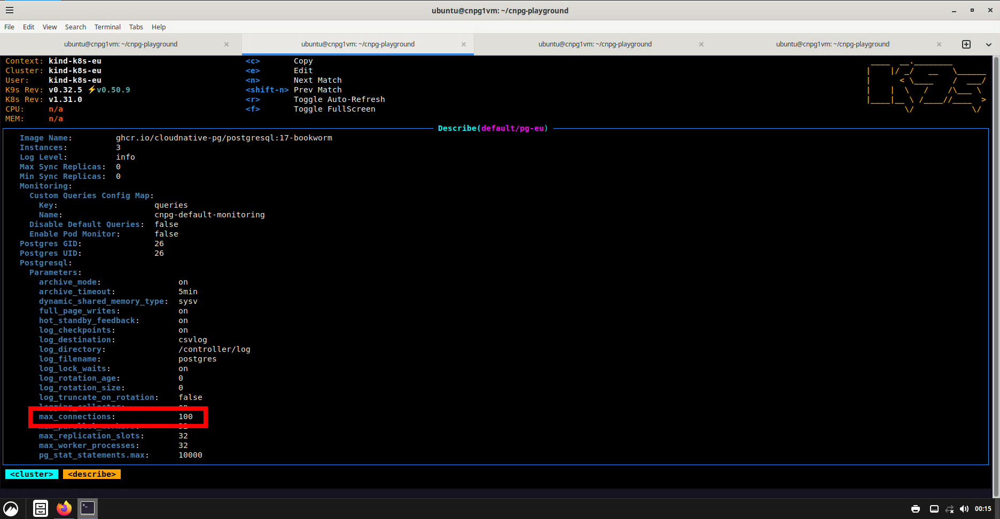
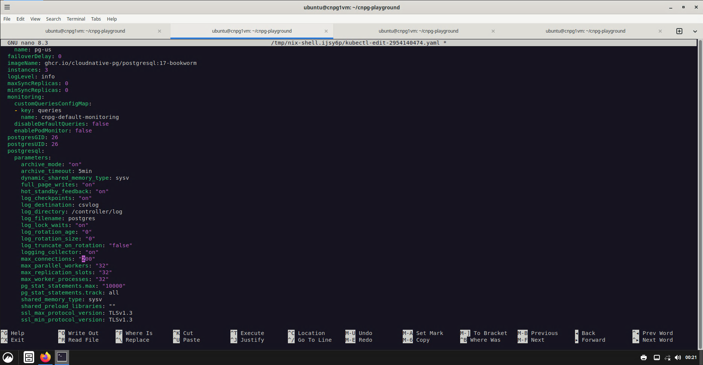
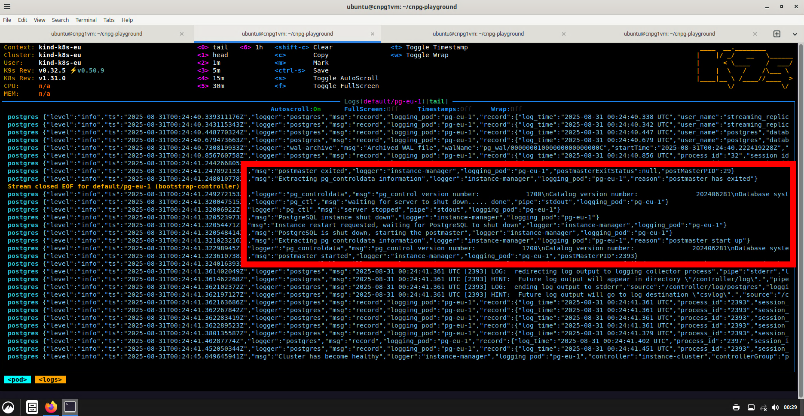

# Starting and Exploring the CNPG Playground

## Starting up the CNPG Playground

Reference the [main CNPG Playground README](../../README.md) for more details
about the Playground.

Run this command to create infrastructure including S3-compatible storage and
kubernetes clusters named `kind-k8s-eu` and `kind-k8s-us`:

```bash
bash scripts/setup.sh
```

Run this comand to deploy the CloudNativePG operator and create postgres clusters
named `pg-eu` and `pg-us` which both have three-node HA within their respective
kubernetes clusters and also replicate data between the two kubernetes clusters:

```bash
LEGACY=true demo/setup.sh
```

*note: there may be an issue with the new backup plugin at the moment?*

A few useful tools to start exploring include `btop` to monitor server
utilization, `lazydocker` to monitor the docker pods (aka k8s nodes),
and `k9s` to explore the kubernetes clusters themselves.

Some aliases are preconfigured:
* `k` for `kubectl`
* `kc` for `kubectl cnpg`
* `c` for `kubectx`
* `n` for `kubens`

Auto-completion is configured for most commands and alaises.


## Explore the CNPG Playground from the Command Line

Try the `c` alias for `kubectx` to list the available Kubernetes contexts. A "context" is a named entry in your kubeconfig that selects which cluster to talk to, which user/credentials to use, and the default namespace.

In the `c` output, the current context appears in bold. Switch to the `kind-k8s-eu` context (where the primary PostgreSQL cluster runs):

```bash
ubuntu@cnpg1vm:~/cnpg-playground$ c
ubuntu@cnpg1vm:~/cnpg-playground$ c kind-k8s-eu
ubuntu@cnpg1vm:~/cnpg-playground$ k config current-context
```

Now try namespaces with the `n` alias for `kubens`. Namespaces logically partition resources inside a cluster and determine the default namespace for your `kubectl` commands.

In the `n` output, the current namespace appears in bold. Try using the `<TAB>` key to autocomplete after typing the first few letters of a namespace.

```bash
ubuntu@cnpg1vm:~/cnpg-playground$ n
ubuntu@cnpg1vm:~/cnpg-playground$ n kube-system
ubuntu@cnpg1vm:~/cnpg-playground$ k get pods

NAME                                           READY   STATUS    RESTARTS      AGE
coredns-6f6b679f8f-9j8m2                       1/1     Running   1 (59m ago)   62m
coredns-6f6b679f8f-jmfgp                       1/1     Running   1 (59m ago)   62m
...
```

PostgreSQL runs in the `default` namespace. Switch back when you're done exploring:

```bash
ubuntu@cnpg1vm:~/cnpg-playground$ n default
ubuntu@cnpg1vm:~/cnpg-playground$ k get pods

NAME      READY   STATUS    RESTARTS   AGE
pg-eu-1   1/1     Running   0          7m54s
pg-eu-2   1/1     Running   0          6m56s
pg-eu-3   1/1     Running   0          6m3s
```

Use the `kc` alias for `kubectl cnpg` to view the status of the Postgres cluster `pg-eu`:

```bash
ubuntu@cnpg1vm:~/cnpg-playground$ kc status pg-eu

Cluster Summary
Name:                pg-eu
Namespace:           default
System ID:           7544528776135057437
PostgreSQL Image:    ghcr.io/cloudnative-pg/postgresql:17-bookworm
Primary instance:    pg-eu-1
Primary start time:  2025-08-30 23:45:12 +0000 UTC (uptime 9m47s)
Status:              Cluster in healthy state
Instances:           3
Ready instances:     3
Current Write LSN:   0/A000148 (Timeline: 1 - WAL File: 00000001000000000000000A)
...
```

Next, use the `kc` alias to open a command-line `psql` session to the Postgres cluster and list all current processes:

```bash
ubuntu@cnpg1vm:~/cnpg-playground$ kc psql pg-eu
psql (17.6 (Debian 17.6-1.pgdg12+1))
Type "help" for help.

postgres=# select pid,backend_type from pg_stat_activity ;
 pid  |         backend_type
------+------------------------------
 1481 | client backend
   37 | autovacuum launcher
   39 | logical replication launcher
  813 | walsender
  929 | walsender
   32 | checkpointer
   33 | background writer
   36 | walwriter
   38 | archiver
(9 rows)

postgres=# exit
```


## Explore the CNPG Playground with k9s

Maximize your terminal shell window, then run `k9s`

To quit from k9s, type `:q` and press `<ENTER>`.

### k9s quick navigation

- Launch/quit: Run `k9s`. Press `Esc` to back out, `:q` to exit.
- Move: Arrow keys or `j/k`. `Enter` to open, `Esc` to go back.
- Filter: `/` then type to filter; `Esc` clears.
- Command bar: `:` then a view like `contexts`, `namespaces`, `pods`, `clusters`, `services`, `secrets`, `events`.
- Actions on a resource: `d` describe, `y` YAML, `e` edit, `l` logs, `s` shell (exec), `x` decode secrets, `CTRL-D` delete.
- Help: `?` shows context-specific shortcuts.

### editing a CNPG cluster

As an exercise, change the `max_connections` postgres parameter from `100` to `200`.

Type `:clusters` to view CNPG postgres clusters in k8s. You should see one cluster named `pg-eu`. (if you see a "US" cluster then you are in the wrong context - type `:context` or use `c` from the command line to switch.)

Select `pg-eu` and press `d` to describe it. Scroll down until you find the Postgres parameters.



Now press the `e` key to open the cluster spec in an editor.  Find the `max_connections` parameter and change it to `200`.

The default editor in the CNPG Lab is `nano`. Press `<CTRL-O>` to save the file, press `<ENTER>` to keep the same filename, and then press `<CTRL-X>` to exit the editor.



Now type `:pods` to return to the pod view.  `pg-eu-1` should still be the primary pod. Select this pod then press the `l` key to view logs.

Find the log messages indicating that Postgres was restarted.  (This is required to change the `max_connections` parameter.)



Type `:q` and press enter to exit `k9s`

You can also invoke the editor from the command line.  Use `kubectl` to change `max_connections` back to `100`.

```bash
ubuntu@cnpg1vm:~/cnpg-playground$ k edit cluster pg-eu

      max_connections: "100"


Warning: Native support for Barman Cloud backups and recovery is deprecated and will be completely removed in CloudNativePG 1.28.0. Found usage in: spec.backup.barmanObjectStore, spec.externalClusters.0.barmanObjectStore, spec.externalClusters.1.barmanObjectStore. Please migrate existing clusters to the new Barman Cloud Plugin to ensure a smooth transition.

cluster.postgresql.cnpg.io/pg-eu edited
```
