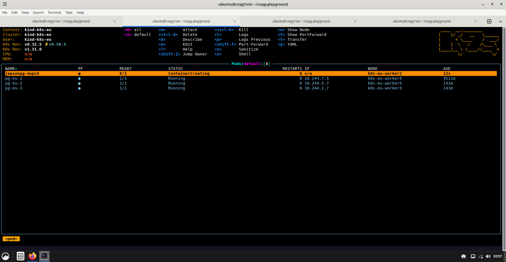
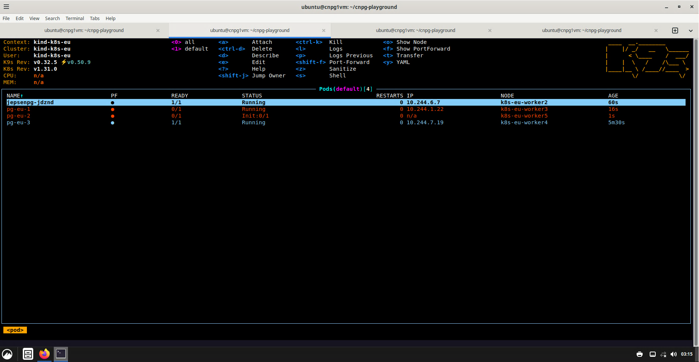
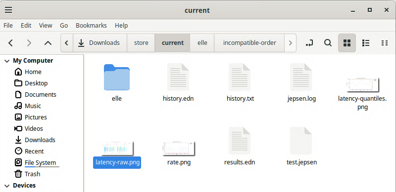
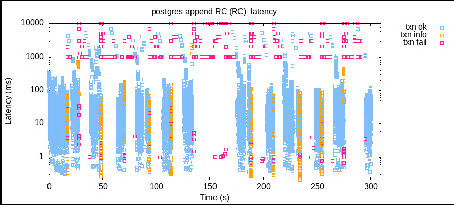
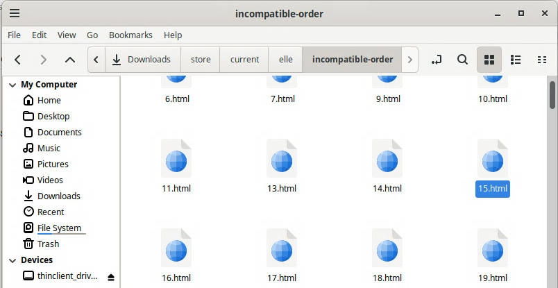
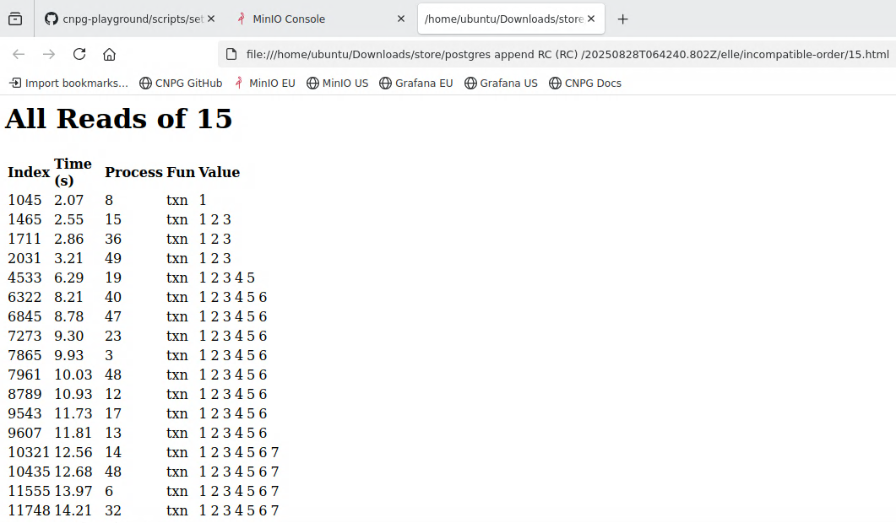
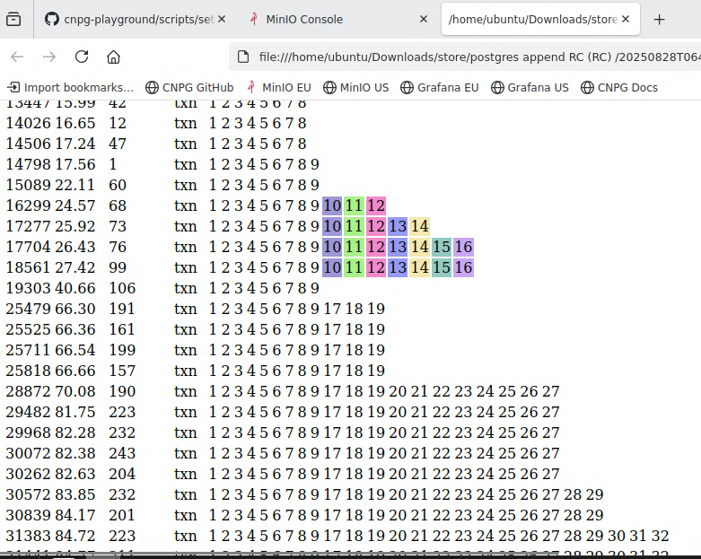
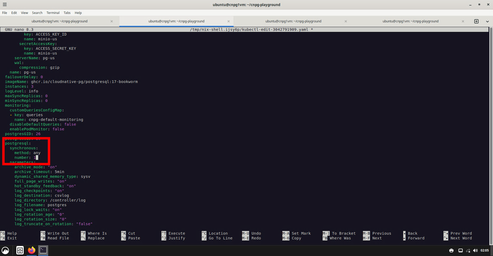
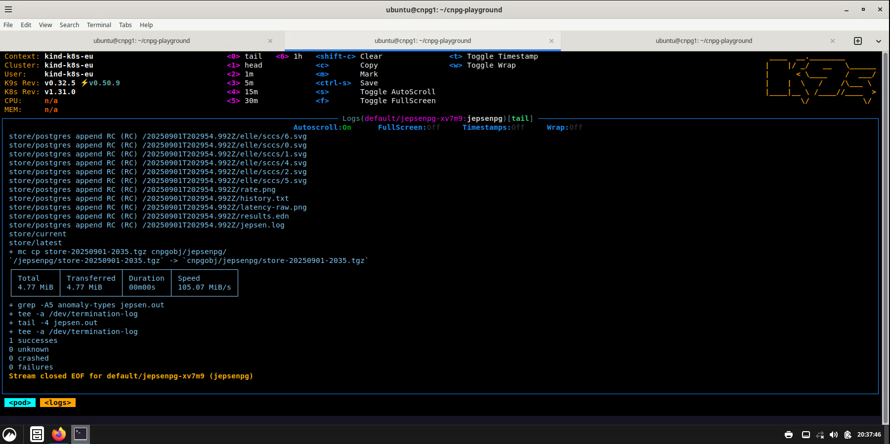
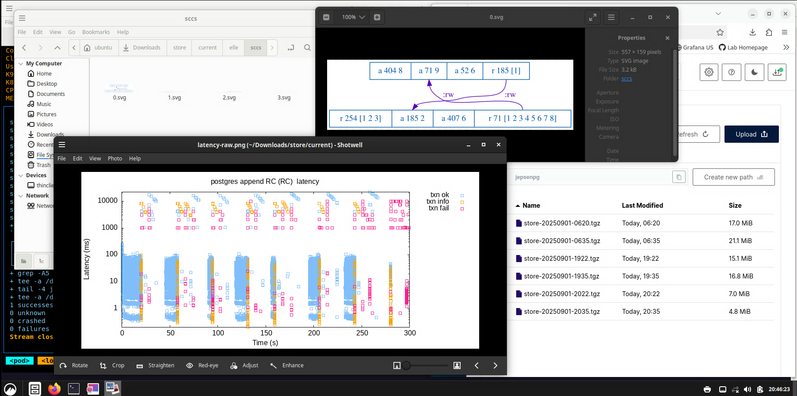

# Running Jepsen Against the CNPG Cluster

- [Overview](#overview)
- [Prerequisites](#prerequisites)
- [Running the Jepsen Test](#running-the-jepsen-test)
  - [Run the Jepsen Test as a Kubernetes Job](#run-the-jepsen-test-as-a-kubernetes-job)
  - [Wait until Jepsen has been RUNNING and READY for 20-30 seconds](#wait-until-jepsen-has-been-running-and-ready-for-20-30-seconds)
  - [Induce repeated primary failures](#induce-repeated-primary-failures)
  - [Check results](#check-results)
  - [Additional useful commands](#additional-useful-commands)
- [Viewing Details of Test Failures](#viewing-details-of-test-failures)
  - [Understanding the Jepsen Append Test](#understanding-the-jepsen-append-test)
  - [Investigating test failures](#investigating-test-failures)
- [Repeat the Test with Synchronous Replication Enabled](#repeat-the-test-with-synchronous-replication-enabled)
  - [Enable Synchronous Replication](#enable-synchronous-replication)
  - [Repeat the test](#repeat-the-test)

## Overview

Jepsen is a testing framework for distributed systems that verifies safety guarantees
by subjecting clusters to faults (e.g., network partitions, crashes, and failovers)
and checking for consistency violations. In this lab exercise, we will use Jepsen to
illustrate data loss when synchronous replication is disabled and cluster
reconfigurations involving postgres failover occur.

This exercise runs the Jepsen "append" workload against the `pg-eu` CloudNativePG
cluster and induces rapid primary failures to stress the system.

## Prerequisites

- The CNPG Playground is up and running with the `pg-eu` cluster available. If you
  haven't started the playground yet, complete Exercise 2 first.
- Your current Kubernetes context targets the cluster where `pg-eu` is running (typically `kind-k8s-eu`).

## Running the Jepsen Test

### Run the Jepsen Test as a Kubernetes Job

A Kubernetes Job runs a one-off or batch task to completion. It creates Pods and
retries failures until the desired number of successful completions is reached,
then stops.

Examine `jepsen-job.yaml` to see how we have configured this test job. It runs for
5 minutes and the backoffLimit and restartPolicy ensure that failures will not be
retried for this specific test.

Delete the US replica cluster to free up some additional CPU (we don't need the US cluster for this lab). Then confirm your context is set to `kind-k8s-eu`:

```bash
k delete cluster pg-us --context kind-k8s-us
```

```bash
k config current-context
```

*(Output of `k config current-context` should be `kind-k8s-eu`.)*

To run the Kubernetes Job that executes Jepsen against `pg-eu`:

```bash
k replace --force -f lab/exercise-3-jepsen/jepsen-job.yaml
```

You can re-run the exact command above to start another test after one completes.

### Wait until Jepsen has been RUNNING and READY for 20-30 seconds

You can see the Pod created by the Jepsen Job with `kubectl` or `k9s`. The first time
you run jepsen, it may stay in `ContainerCreating` status for some time while it downloads
the container from dockerhub.

After the jepsen container is RUNNING and READY, **wait for 20-30 seconds** before you
start to introduce chaos.




### Induce repeated primary failures

For starting out, we're not using Jepsen's fault injection capabilities (called "nemesis").

Instead, we take a simpler direct approach. This makes it easier to see exactly what's happening.

After Jepsen has been running for 20–30 seconds, copy and paste this into your terminal window to
continuously kill the current primary pod whenever there's a healthy replica (making sure there's
at least 8 seconds between each kill).

```bash
while true; do
  until k get pod -l role=replica | grep -q 1/1; do sleep 1; done
  k delete pod -l role=primary --grace-period=0 --force --wait=false |& egrep -v '(Warn|found)' && date && sleep 8
done
```

Press `CTRL-C` to stop the loop when you are done.

You can watch the chaos unfold from `k9s`. You will see pods continually being killed and you will see CNPG bringing
them back online. Try using the `l` key to tail the logs for postgres pods during chaos testing.



### Check results

When the job finishes, check the summary message and full logs:

```bash
k get pod -l job-name=jepsenpg -o jsonpath='{.items[0].status.containerStatuses[0].state.terminated.message}{"\n"}'
```

```bash
k logs -l job-name=jepsenpg --tail=-1
```

- `1 failures` means a failure (such as data loss) was detected.
- `1 successes` means no failures were observed.
- `crashed` or `unknown` means the run was inconclusive; re-run the test.

### Additional useful commands

General navigation and status:

```bash
k9s
k get pod -l role=primary
kc status pg-eu
```

Inspect current queries and performance stats from Postgres:

```bash
kc psql pg-eu -- -c "select pg_stat_statements_reset(); select pg_sleep(1); select clock_timestamp(), left(query,40) query,calls,mean_exec_time,total_exec_time from pg_stat_statements where query not like 'select pg_sleep%' order by 5 desc limit 20;"
```

Monitor active Jepsen sessions and waits:

```bash
kc psql pg-eu -- -c "select now(), query, wait_event_type, wait_event, count(*) from pg_stat_activity where state='active' and application_name like 'jepsen%' group by query,wait_event_type,wait_event;"
```

## Viewing Details of Test Failures

### Understanding the Jepsen Append Test

A good in-depth explanation of the Jepsen workload is available from CMU's quarentine tech talk series, starting with the discussion of Atul Adya's work to define isolation levels in terms of dependency cycles.
* https://www.youtube.com/watch?v=OPJ_IcdSqig
* http://pmg.csail.mit.edu/papers/adya-phd.pdf

For completing this lab exercise, we only need a simplified description of how the test
works.

Jepsen has a table and it updates rows in that table. Basically, the only thing it does
is a string append on individual rows in its table.

The Jepsen test client keeps a log of all the historical values it has seen and it will
analyze the history after the test completes. For our test, as we walk through time, if
a chunk of a string suddenly disappears then that tells us we lost some data.

### Investigating test failures

You should see something like this in the kubernetes job log for test failures:

```
┌───────────┬─────────────┬──────────┬──────────────┐
│ Total     │ Transferred │ Duration │ Speed        │
│ 18.63 MiB │ 18.63 MiB   │ 00m00s   │ 233.46 MiB/s │
└───────────┴─────────────┴──────────┴──────────────┘
+ grep -A5 anomaly-types jepsen.out
+ tee -a /dev/termination-log
            :anomaly-types (:cycle-search-timeout :incompatible-order),
            :anomalies {:cycle-search-timeout [{:type :cycle-search-timeout,
                                                :anomaly-spec-type :G-single-item,
                                                :does-not-contain (),
                                                :scc-size 76936}],
                        :incompatible-order ({:key 0,
+ tail -4 jepsen.out
+ tee -a /dev/termination-log
0 successes
0 unknown
0 crashed
1 failures
```

Full detailed Jepsen results are automatically uploaded to an object store bucket in
`minio-eu` when the test completes. There’s a bookmark for `MinIO-EU` in Firefox (which
automatically opens when you connect to the Remote Desktop).

default username: `cnpg-eu`
default password: `postgres5432-eu`
[source](https://github.com/cloudnative-pg/cnpg-playground/blob/ae93e2a131f9d15be840ebc3268283d9b37df302/scripts/setup.sh#L36-L37)

You can click the Firefox bookmark for minio-eu and then download the Jepsen test results
tarball from the browser into your Remote Desktop. After downloading the tarball, open
the file browser from the launcher icon at the bottom of your Remote Desktop. Find the
file in your Downloads folder, right click on it, then choose "Extract Here" to extract
the contents.

First open the file latency-raw.png - this has your overall timeline. You can get a general
sense of how long failovers took from the client perspective.



Here's an example of what this file looks like. The vertical blue bars are periods of
successful transactions and the blank spaces with sparse red squares are period of
unavailability:



The folder `elle/incompatible-order` has the data loss details.

Each file represents the timeline/history for one specific row in the table (by primary key).



When you open one of these files, you're going to see the timeline. On the left side is a list
of timestamps. At each timestamp, you see the value in that row get longer one committed
transaction at a time. What you’re going to see is a timestamp where suddenly the row gets
inexplicably shorter - and a bunch of missing values in the middle of the string, and then
it continues appending but never gets the missing data back.

Below, i've opened `15.html` which shows all reads of the row with primary key `15`:



Remember that in this test, jepsen only ever appends values to the string. After scrolling to
the second page, I can see that we lost about 3 seconds worth of committed durable data. The
read at time `40.66` has lost all the updates between time `24.57` and time `27.42`.



Next, we will enable Postgres synchronous replication and repeat the test.

## Repeat the Test with Synchronous Replication Enabled

In between tests, run `demo/teardown.sh` and then creating a clean new cluster with
`LEGACY=true demo/setup.sh` ... so that we can start clean each time. Sometimes the chaos
testing can make CNPG a little unhappy!

### Enable Synchronous Replication

The `kubectl cnpg status` command will show you that synchronous replication is disabled.

Look for `Standby (async)`:

```
ubuntu@cnpg1vm:~/cnpg-playground$ kc status pg-eu
Cluster Summary
Name:                pg-eu
Namespace:           default
...
...
Instances status
Name     Database Size  Current LSN  Replication role  Status  QoS         Manager Version  Node
----     -------------  -----------  ----------------  ------  ---         ---------------  ----
pg-eu-1                 0/10000060   Primary           OK      BestEffort  1.27.0           k8s-eu-worker4
pg-eu-2                 0/10000060   Standby (async)   OK      BestEffort  1.27.0           k8s-eu-worker5
pg-eu-3                 0/10000060   Standby (async)   OK      BestEffort  1.27.0           k8s-eu-worker3
```

Edit the `pg-eu` CNPG cluster and enable quorum-based synchronous replication with required
response from at least one standby server:

```
postgresql:
  synchronous:
    method: any
    number: 1
```

https://cloudnative-pg.io/documentation/current/replication/#quorum-based-synchronous-replication




Use `kubectl cnpg status` to confirm that synchronous replication is now enabled.

Look for `Standby (sync)`:

```
ubuntu@cnpg1vm:~/cnpg-playground$ kc status pg-eu
Cluster Summary
Name:                pg-eu
Namespace:           default
...
...
Instances status
Name     Database Size  Current LSN  Replication role  Status  QoS         Manager Version  Node
----     -------------  -----------  ----------------  ------  ---         ---------------  ----
pg-eu-1                 0/10000060   Primary           OK      BestEffort  1.27.0           k8s-eu-worker4
pg-eu-2                 0/10000060   Standby (sync)    OK      BestEffort  1.27.0           k8s-eu-worker5
pg-eu-3                 0/10000060   Standby (sync)    OK      BestEffort  1.27.0           k8s-eu-worker3
```

### Repeat the test

Repeat the jepsen test. Once synchronous replication is enabled, you should no longer see data loss
when killing the primary pod.

```bash
k replace --force -f lab/exercise-3-jepsen/jepsen-job.yaml
```

```bash
while true; do
  until k get pod -l role=replica | grep -q 1/1; do sleep 1; done
  k delete pod -l role=primary --grace-period=0 --force --wait=false |& egrep -v '(Warn|found)' && date && sleep 8
done
```

Here’s an example screenshot after a test with synchronous replication enabled:



Drilling down into the test results, we can see from latency-raw.png that our periods of
unavailability were slightly longer. This makes sense because we don’t want postgres to
accept writes if there are no healthy replicas.

Under the directory `elle/sccs` ("Strongly Connected Components" or SCCs), we can see a
few graphs Jepsen has generated for dependency graph cycles that it detected during this
test. The screenshot below shows two transactions:

1. A transaction APPENDS the value 9 to record 71, before it READS record 185 (value 1)
2. A transaction APPENDS the value 2 to record 185, before it READS record 71 (values 1-8)

Logically, this does not make sense. Which transaction happens before the other? This kind
of cycle anomaly is one of the differences between read-committed isolation and serializable
isolation. Right now we have configured postgres in read-committed mode so Jepsen simply
documents the cycles while considering the test successful.


