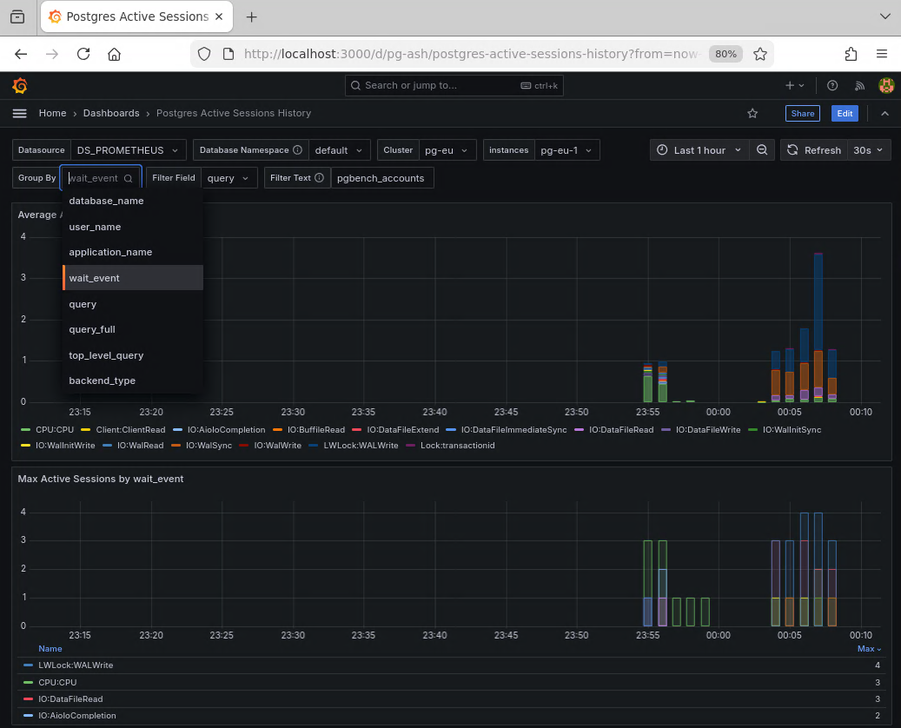

# Monitoring Active Session History (ASH) in PostgreSQL

- [Overview](#overview)
- [Prerequisites](#prerequisites)
- [Setting Up ASH Monitoring](#setting-up-ash-monitoring)
  - [Apply the PostgreSQL Cluster Configuration Patch](#apply-the-postgresql-cluster-configuration-patch)
  - [Create the SQL Functions](#create-the-sql-functions)
  - [Apply the Prometheus Custom Queries ConfigMap](#apply-the-prometheus-custom-queries-configmap)
  - [Verify the Setup](#verify-the-setup)
- [Importing the Grafana Dashboard](#importing-the-grafana-dashboard)
- [Generating Workload with pgbench](#generating-workload-with-pgbench)
  - [Initialize the pgbench Database](#initialize-the-pgbench-database)
  - [Run the pgbench Workload](#run-the-pgbench-workload)
- [Understanding the ASH Dashboard](#understanding-the-ash-dashboard)
- [Automation Script](#automation-script)

## Overview

Active Session History (ASH) is a powerful performance monitoring technique that
periodically samples active database sessions and stores the snapshots for
historical analysis. Similar to Oracle's ASH feature, this approach enables
"time travel" debugging - you can investigate what was happening in your
database at any point in the past.

This exercise demonstrates how to set up PostgreSQL Active Session History
monitoring using:

- **pgsentinel** - A PostgreSQL extension that samples `pg_stat_activity` and
  stores the data in `pg_active_session_history`
- **Custom Prometheus queries** - Exports ASH metrics with careful cardinality
  control
- **Grafana dashboard** - Visualizes active sessions over time with flexible
  grouping and filtering

The custom Prometheus queries export three key metrics:

- `cnpg_ash_avg_active_sessions` - Average active sessions grouped by various
  dimensions (wait_event, query, user, etc.)
- `cnpg_ash_max_by_wait_event_cnt` - Peak concurrency per wait event (top 5)
- `cnpg_ash_max_by_query_full_cnt` - Peak concurrency per query (top 10)

## Prerequisites

- The CNPG Playground is up and running with the `pg-eu` cluster available. If
  you haven't started the playground yet, complete the setup first.
- The monitoring stack (Prometheus and Grafana) must be running. If you haven't
  set up monitoring yet, run `monitoring/setup.sh` from the playground root.
- Your current Kubernetes context targets the cluster where `pg-eu` is running
  (typically `kind-k8s-eu`).

## Setting Up ASH Monitoring

### Apply the PostgreSQL Cluster Configuration Patch

The `pg-eu` cluster needs to be configured with the pgsentinel extension and
monitoring setup. A patch file is provided that adds:

- The pgsentinel extension container image
- `pgsentinel` in `shared_preload_libraries`
- A reference to the custom Prometheus queries ConfigMap

**Note:** All commands in this exercise should be run from the CNPG playground
root directory (`~/cnpg-playground`).

First, confirm your context is set to `kind-k8s-eu`:

```bash
k config current-context
```

*(Output should be `kind-k8s-eu`.)*

Apply the patch to `demo/yaml/eu/pg-eu.yaml` from the CNPG playground root directory:

```bash
cd ~/cnpg-playground
patch -p1 < lab/exercise-4-active-session-history/pg-eu.yaml.patch
```

You can verify the changes with:

```bash
git diff demo/yaml/eu/pg-eu.yaml
```

Apply the modified cluster configuration:

```bash
k apply -f demo/yaml/eu/pg-eu.yaml
```

The cluster will perform a rolling restart to load the pgsentinel extension.
Wait for all pods to be ready:

```bash
k wait --timeout 5m --for=condition=Ready pod -l cnpg.io/cluster=pg-eu
```

### Create the SQL Functions

Two SQL functions need to be installed in the `postgres` database:

1. **`sanitize_sql`** - Removes sensitive data from query texts before
   exporting to Prometheus
2. **`pgsentinel_poll_ash_data`** - Implements incremental polling of ASH
   data with slot-based tracking

Create the `sanitize_sql` function:

```bash
kc psql pg-eu < lab/exercise-4-active-session-history/sanitize_sql.sql
```

Create the `pgsentinel_poll_ash_data` function:

```bash
kc psql pg-eu < lab/exercise-4-active-session-history/pgsentinel_poll_ash_data.sql
```

### Apply the Prometheus Custom Queries ConfigMap

The ConfigMap defines three custom Prometheus queries that export ASH metrics.
The queries implement cardinality control by limiting output to the top entries
and aggregating others into an "other" bucket.

Apply the ConfigMap:

```bash
k apply -f lab/exercise-4-active-session-history/ash-top-sessions.yaml
```

The CNPG operator will automatically pick up the ConfigMap (thanks to the
`cnpg.io/reload: ""` label) and restart the metrics exporter to begin collecting
ASH data.

### Verify the Setup

Verify that the pgsentinel extension is loaded:

```bash
kc psql pg-eu -- -c "SELECT * FROM pg_extension WHERE extname = 'pgsentinel';"
```

You should see the pgsentinel extension listed.

Check that ASH data is being collected:

```bash
kc psql pg-eu -- -c "SELECT COUNT(*) FROM pg_active_session_history;"
```

The count should be greater than zero (it may take a minute or two for samples
to accumulate).

## Importing the Grafana Dashboard

The ASH dashboard provides two visualization panels:

1. **Average Active Sessions** - Stacked bar chart showing average concurrency
2. **Max Active Sessions** - Shows peak concurrency for each dimension

To import the dashboard:

1. Open Grafana in your browser. In the CNPG Lab VM, Firefox has a bookmark for
   Grafana-EU, or you can navigate to `http://localhost:3000`

2. Log in with the default credentials:
   - Username: `admin`
   - Password: `admin`

3. Click the "+" icon or "Dashboards" menu, then select "Import"

4. Click "Upload dashboard JSON file"

5. Navigate to the CNPG playground directory and select:
   `lab/exercise-4-active-session-history/ash-top-sessions-dashboard.json`

6. On the import screen, select your Prometheus datasource from the dropdown

7. Click "Import"

The dashboard will open automatically after import.

## Generating Workload with pgbench

To see ASH data in action, we'll use pgbench to generate a realistic database
workload.

### Initialize the pgbench Database

Initialize the pgbench schema with a scale factor of 100 (this creates tables
with approximately 10 million rows):

```bash
kc pgbench pg-eu -- -i --scale 100
```

This will take several minutes to complete. Check the status with:

```bash
k get pods | grep pgbench
```

When initialization is running, you'll see:
```
pg-eu-pgbench-xxxx-xxxxx   1/1     Running     0          2m
```

When complete, the pod status will change to `Completed`:
```
pg-eu-pgbench-xxxx-xxxxx   0/1     Completed   0          5m
```

### Run the pgbench Workload

Run pgbench with 4 clients, rate-limited to 100 transactions per second, for 5
minutes:

```bash
kc pgbench pg-eu -- --client=4 --jobs=4 --rate=100 --progress=1 --time=300
```

While pgbench is running, switch to your Grafana dashboard to watch the active
sessions in real-time. You should see:

- Active sessions grouped by wait events (CPU, IO waits, lock waits, etc.)
- Peak concurrency metrics showing the maximum sessions at any sampling point




## Understanding the ASH Dashboard

The ASH dashboard provides flexible analysis through several features:

**Dashboard Variables:**

- **Group By** - Choose which dimension to group sessions by:
  - `wait_event` - Shows what sessions are waiting on (CPU, IO, locks, etc.)
  - `query` - Groups by sanitized query text (first 40 characters)
  - `query_full` - Groups by query ID and full sanitized query
  - `user_name` - Groups by database user
  - `application_name` - Groups by client application
  - `database_name` - Groups by database
  - `backend_type` - Groups by backend type (client backend, autovacuum, etc.)

- **Filter Field** & **Filter Text** - Filter the data by any dimension. For
  example, set Filter Field to `query` and Filter Text to `UPDATE` to show only
  UPDATE statements.

**Panel 1: Average Active Sessions**

In the background, pgsentinel is checking the state of every postgres connection
every single second. While prometheus only gathers metrics from the database
once a minute, this panel is able to present average active session values
that are aggregated from all of the 1-second samples. This is much more powerful
than only seeing data which is gathered once per minute.

This stacked bar chart shows the average number of active sessions over time,
grouped by your selected dimension. The height of each bar represents the
average active session count during that time period.

When viewing wider periods of time, prometheus will correctly average the
values for larger periods.

**Panel 2: Max Active Sessions by [dimension]**

This panel is able to look at all of the 1-second samples during the sampling
period and display the highest observed number of active sessions during any
interval.

For example, if a critical lock is held for only 2 seconds - blocking hundreds
of connections during those 2 seconds - then that data can easily be buried in
average values. But this panel will find the peak and you'll see that there
was a single moment in time when hundreds of connections were all on the same
wait event or SQL query (using the query_full grouping).

**Cardinality Control:**

The custom Prometheus queries implement careful cardinality control to prevent
overwhelming the monitoring system. The main `ash` query limits output to the
top 40 distinct label combinations, aggregating others into an "other" bucket.
The ranking prioritizes collecting comprehensive data for the top wait events:

1. Non-client backends first (system activity always visible)
2. Top wait events within the collection period (using totals per wait event)
3. Query/user/etc with highest active session count

Importantly, if a query includes a few lower-ranking waits, those active session
counts may end up aggregated into the "other" bucket to reduce metric cardinality.

## Automation Script

After you've learned how the ASH setup works, you can use the
`test-ash-setup.sh` script to automatically configure and run the exercise:

```bash
bash lab/exercise-4-active-session-history/test-ash-setup.sh
```

The script will:

- Apply the PostgreSQL cluster patch
- Create the SQL functions
- Apply the ConfigMap
- Initialize and run pgbench
- Provide instructions for importing the Grafana dashboard

The script creates a log file with timestamp for troubleshooting.
