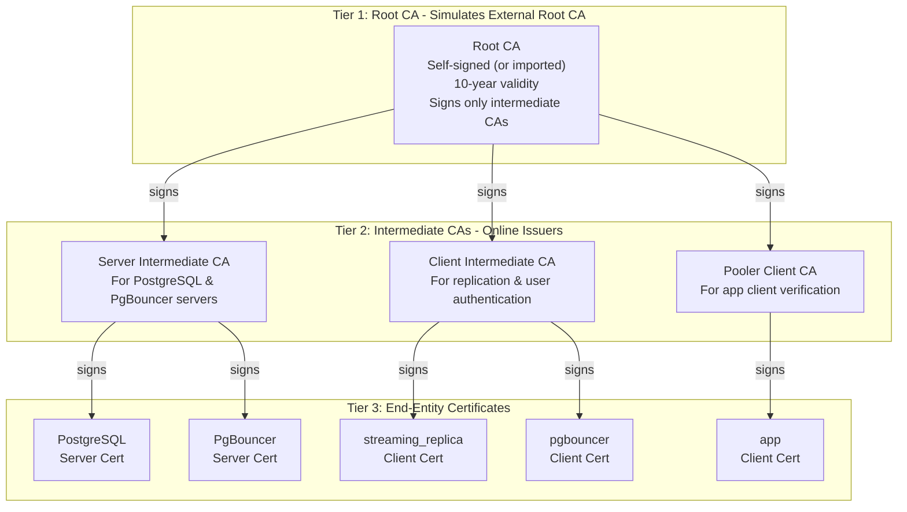
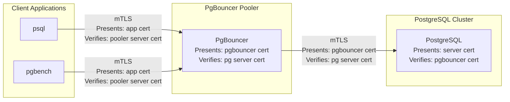

# PgBouncer Connection Pooling with mTLS Certificate Authentication

- [Overview](#overview)
- [Prerequisites](#prerequisites)
- [Understanding the Architecture](#understanding-the-architecture)
  - [Three-Tier PKI (External CA Integration)](#three-tier-pki-external-ca-integration)
  - [Connection Flow](#connection-flow)
- [Setting Up PgBouncer with mTLS](#setting-up-pgbouncer-with-mtls)
  - [Apply cert-manager Certificates](#apply-cert-manager-certificates)
  - [Apply the PostgreSQL Cluster Configuration Patch](#apply-the-postgresql-cluster-configuration-patch)
  - [Deploy the PgBouncer Pooler](#deploy-the-pgbouncer-pooler)
- [Testing mTLS Connections](#testing-mtls-connections)
  - [Extract Client Certificates](#extract-client-certificates)
  - [Test with psql](#test-with-psql)
  - [Test with pgbench](#test-with-pgbench)
  - [Verify mTLS Enforcement](#verify-mtls-enforcement)
- [Understanding PgBouncer Configuration](#understanding-pgbouncer-configuration)
- [Troubleshooting](#troubleshooting)
- [Automation Script](#automation-script)

## Overview

Connection pooling is a critical technique for managing database connections
efficiently in production environments. PgBouncer is a lightweight connection
pooler for PostgreSQL that maintains a pool of connections to the database and
multiplexes client connections through them.

This exercise demonstrates how to:

- Set up a **three-tier PKI** using cert-manager that simulates production
  external CA integration
- Configure **CloudNativePG** to use cert-manager certificates instead of
  self-signed certificates
- Deploy **PgBouncer** with full **mTLS (mutual TLS)** authentication
- Connect to PostgreSQL through PgBouncer using certificate-based authentication
- Test with both **psql** and **pgbench** workloads

### Why mTLS?

Mutual TLS provides strong authentication by requiring both the client and
server to present valid certificates:

- **Server authentication**: Clients verify they're connecting to the legitimate
  PostgreSQL/PgBouncer instance
- **Client authentication**: The server verifies the client's identity using
  certificates instead of passwords
- **Encryption**: All traffic is encrypted with TLS 1.3
- **No password storage**: Eliminates password management overhead and security
  risks

### Why cert-manager?

In production environments, certificates are typically managed by an external PKI
system like HashiCorp Vault, AWS Private CA, or Let's Encrypt. cert-manager provides:

- Automatic certificate issuance and renewal
- Integration with multiple certificate authorities (Vault, AWS PCA, Let's Encrypt, ACME, etc.)
- Native Kubernetes CRDs for certificate management
- Automatic secret rotation with the `cnpg.io/reload` label

This exercise simulates external CA integration using cert-manager's CA issuer.

## Prerequisites

- The CNPG Playground is up and running with the `pg-eu` cluster available. If
  you haven't started the playground yet, complete Exercise 2 first.
- cert-manager is installed (automatically installed by the playground setup).
- Your current Kubernetes context targets the cluster where `pg-eu` is running
  (typically `kind-k8s-eu`).
- PostgreSQL client tools (`psql` and `pgbench`) are installed locally.

## Understanding the Architecture

### Three-Tier PKI (External CA Integration)

This exercise creates a three-tier certificate hierarchy that mirrors how
cert-manager integrates with an external certificate authority in production:



**In production with an external CA:**

- The Root CA is managed by your external CA system (Vault, AWS Private CA, etc.)
- cert-manager uses an external issuer (Vault, ACME, AWS PCA) to request certificates
- This lab uses self-signed + CA issuers to simulate that pattern

### Connection Flow



## Setting Up PgBouncer with mTLS

**Note:** All commands in this exercise should be run from the CNPG playground
root directory (`~/cnpg-playground`).

First, confirm your context is set to `kind-k8s-eu`:

```bash
k config current-context
```

*(Output should be `kind-k8s-eu`.)*

### Apply cert-manager Certificates

The certificate YAML defines the complete three-tier PKI:

- **Tier 1**: Root CA and Root CA Issuer
- **Tier 2**: Server Intermediate CA, Client Intermediate CA, and their issuers
- **Tier 3**: All end-entity certificates (server and client)

Apply the certificates:

```bash
cd ~/cnpg-playground
k apply -f lab/exercise-5-pgbouncer-mtls/cert-manager-certs.yaml
```

Wait for all certificates to be ready (this may take 30-60 seconds):

```bash
# Wait for Root CA
kubectl wait --timeout=2m --for=condition=Ready certificate/pg-eu-root-ca

# Wait for Intermediate CAs
kubectl wait --timeout=2m --for=condition=Ready certificate/pg-eu-server-ca
kubectl wait --timeout=2m --for=condition=Ready certificate/pg-eu-client-ca
kubectl wait --timeout=2m --for=condition=Ready certificate/pg-eu-pooler-client-ca

# Wait for end-entity certificates
kubectl wait --timeout=2m --for=condition=Ready certificate/pg-eu-server-cert
kubectl wait --timeout=2m --for=condition=Ready certificate/pg-eu-pooler-server-cert
kubectl wait --timeout=2m --for=condition=Ready certificate/pg-eu-replication-cert
kubectl wait --timeout=2m --for=condition=Ready certificate/pg-eu-pooler-client-cert
kubectl wait --timeout=2m --for=condition=Ready certificate/pg-eu-app-cert
```

Verify all certificates are ready:

```bash
kubectl get certificates
```

You should see all certificates with `READY=True`.

### Apply the PostgreSQL Cluster Configuration Patch

The patch adds:

- `certificates` section referencing cert-manager-created secrets
- `managed.roles` to create `pgbouncer` and `app` users
- `pg_hba` entries for certificate-based authentication
- `pg_ident` mapping to allow pgbouncer to connect as app

Apply the patch:

```bash
patch -p1 < lab/exercise-5-pgbouncer-mtls/pg-eu.yaml.patch
```

Verify the changes:

```bash
git diff demo/yaml/eu/pg-eu.yaml
```

Apply the modified cluster configuration:

```bash
k apply -f demo/yaml/eu/pg-eu.yaml
```

The cluster will perform a rolling restart to apply the new certificate
configuration. Wait for all pods to be ready (this may take several minutes):

```bash
k wait --timeout 10m --for=condition=Ready pod -l cnpg.io/cluster=pg-eu
```

Wait for the cluster to be ready:

```bash
k wait --timeout 5m --for=condition=Ready cluster/pg-eu
```

### Deploy the PgBouncer Pooler

The pooler configuration enables full mTLS with `verify-full` mode on both
client and server sides.

Deploy the pooler:

```bash
k apply -f lab/exercise-5-pgbouncer-mtls/pg-eu-pooler.yaml
```

Wait for the pooler to be ready:

```bash
k wait --timeout 5m --for=condition=Ready pod -l cnpg.io/poolerName=pg-eu-pooler-rw
```

Verify the pooler is running:

```bash
kubectl get pooler pg-eu-pooler-rw
kubectl get pods -l cnpg.io/poolerName=pg-eu-pooler-rw
```

## Testing mTLS Connections

The easiest way to test is using a Kubernetes pod that has the certificates
automatically mounted from secrets. A test pod manifest and a comprehensive
test job are provided.

### Option 1: Run the Test Job (Recommended)

The test job runs all tests automatically:

```bash
kubectl apply -f lab/exercise-5-pgbouncer-mtls/test-job.yaml

# Watch the test progress
kubectl logs -f job/pgbouncer-mtls-test

# Check final status
kubectl get job pgbouncer-mtls-test
```

The job tests:
1. psql connection with mTLS
2. SSL connection details verification  
3. pgbench initialization (scale factor 10)
4. pgbench workload (30 seconds, 2 clients)

### Option 2: Interactive Testing with Test Pod

Deploy an interactive test pod:

```bash
kubectl apply -f lab/exercise-5-pgbouncer-mtls/test-client-pod.yaml
kubectl wait --timeout=60s --for=condition=Ready pod/pgbouncer-mtls-test
```

Connect with psql:

```bash
kubectl exec pgbouncer-mtls-test -- \
  env PGSSLMODE=verify-full \
      PGSSLCERT=/etc/secrets/client/tls.crt \
      PGSSLKEY=/etc/secrets/client/tls.key \
      PGSSLROOTCERT=/etc/secrets/ca/ca.crt \
  psql -h pg-eu-pooler-rw -U app postgres
```

Once connected, verify the SSL connection:

```sql
SELECT version, cipher, bits, client_dn 
FROM pg_stat_ssl 
WHERE pid = pg_backend_pid();
```

### Test with pgbench

Run pgbench workload through the pooler:

```bash
kubectl exec pgbouncer-mtls-test -- \
  env PGPASSWORD="" \
      PGSSLMODE=verify-full \
      PGSSLCERT=/etc/secrets/client/tls.crt \
      PGSSLKEY=/etc/secrets/client/tls.key \
      PGSSLROOTCERT=/etc/secrets/ca/ca.crt \
  pgbench -h pg-eu-pooler-rw -U app postgres -c 2 -j 2 -T 30 --progress=5
```

### Understanding the Certificate Flow

The mTLS connection uses:

- **Client Certificate**: `pg-eu-app-cert` (CN=app, signed by pooler-client-ca)
- **Server Certificate**: Pooler presents `pg-eu-pooler-server-cert` (signed by server-ca)
- **Root CA for Verification**: `pg-eu-server-ca/ca.crt` (Root CA)

The client verifies the pooler's certificate chain:
1. Pooler presents: Server cert + Server Intermediate CA
2. Client verifies using: Root CA
3. Chain: Server cert → Server Intermediate CA → Root CA ✓

## Understanding PgBouncer Configuration

Key configuration parameters in the pooler:

```yaml
pgbouncer:
  poolMode: session  # Session pooling (one connection per session)
  authQuery: "SELECT $1, NULL"  # Required for cert auth compatibility
  
  parameters:
    server_tls_protocols: tlsv1.3  # Only TLS 1.3
    auth_type: cert                # Certificate-based authentication
    server_tls_sslmode: verify-full  # Verify PostgreSQL certificate
    client_tls_sslmode: verify-full  # Verify client certificates
    default_pool_size: "10"        # 10 connections per user/db pair
    max_client_conn: "100"         # Max 100 client connections
  
  # IMPORTANT: CNPG pooler secret naming is based on TLS direction
  # serverTLSSecret: cert for pooler → PostgreSQL (pooler as client)
  # clientTLSSecret: cert for client → pooler (pooler as server)
  serverTLSSecret:
    name: pg-eu-pooler-client-cert  # Has CN=pgbouncer, client auth usage
  clientTLSSecret:
    name: pg-eu-pooler-server-cert  # Has DNS SANs, server auth usage
```

**Certificate Usage Summary:**

| Connection | Certificate | Usage | Signed By |
|------------|-------------|-------|-----------|
| Client → Pooler | pg-eu-app-cert | client auth | pooler-client-ca |
| Pooler → Client | pg-eu-pooler-server-cert | server auth | server-ca |
| Pooler → PostgreSQL | pg-eu-pooler-client-cert | client auth | client-ca |
| PostgreSQL → Pooler | pg-eu-server-cert | server auth | server-ca |

View PgBouncer statistics:

```bash
# Show pool status
kubectl cnpg pgbouncer pg-eu-pooler-rw -- -c 'SHOW POOLS;'

# Show active clients
kubectl cnpg pgbouncer pg-eu-pooler-rw -- -c 'SHOW CLIENTS;'

# Show servers
kubectl cnpg pgbouncer pg-eu-pooler-rw -- -c 'SHOW SERVERS;'

# Show configuration
kubectl cnpg pgbouncer pg-eu-pooler-rw -- -c 'SHOW CONFIG;'
```

## Troubleshooting

### Certificate Issues

Check certificate status:

```bash
kubectl get certificates
kubectl describe certificate pg-eu-app-cert
```

View certificate details:

```bash
kubectl get secret pg-eu-app-cert -o jsonpath='{.data.tls\.crt}' | \
  base64 -d | openssl x509 -text -noout
```

### Connection Issues

Check PgBouncer logs:

```bash
kubectl logs -l cnpg.io/poolerName=pg-eu-pooler-rw
```

Check PostgreSQL logs:

```bash
kubectl logs pg-eu-1 -c postgres | tail -50
```

Verify pg_hba configuration:

```bash
kubectl cnpg psql pg-eu -- -c "SELECT * FROM pg_hba_file_rules WHERE type = 'hostssl';"
```

### Common Issues

**"SSL error: certificate verify failed"**

- Ensure you're using the correct CA certificate (`pg-eu-server-ca`)
- Verify the server certificate includes the correct DNS names

**"FATAL: certificate authentication failed"**

- Check that the client certificate CN matches the PostgreSQL user (`app`)
- Verify pg_hba rules allow certificate authentication
- Check pg_ident mappings for pooler connections

**"Connection refused"**

- Verify port-forward is running: `ps aux | grep port-forward`
- Check pooler pods are running: `kubectl get pods -l cnpg.io/poolerName=pg-eu-pooler-rw`

## Automation Script

After you've learned how PgBouncer with mTLS works through the manual steps above,
you can use the automation script to quickly set up and verify the configuration:

```bash
cd ~/cnpg-playground
bash lab/exercise-5-pgbouncer-mtls/test-pgbouncer-mtls-setup.sh
```

The script automates all the manual steps you practiced:
1. Applies cert-manager certificates and waits for them to be ready
2. Applies the cluster configuration patch
3. Waits for the cluster to restart
4. Deploys the PgBouncer pooler
5. Runs a Kubernetes Job that tests mTLS connections with psql and pgbench

This script is primarily used to validate that the manual steps in this README are correct
and can also be used for quickly setting up the exercise environment for demonstrations.

Output is logged to `pgbouncer-mtls-test_<timestamp>.log`.

## Cleanup

To remove all Exercise 5 resources and revert to the original state:

```bash
cd ~/cnpg-playground
bash lab/exercise-5-pgbouncer-mtls/cleanup.sh
```

This removes the pooler, certificates, issuers, reverts cluster configuration,
and cleans up temporary files. After cleanup, you can re-run the exercise.

## Next Steps

After completing this exercise, proceed to **Exercise 6: Cross-Cluster Replication**
to learn how to set up the pg-us replica cluster with mTLS authentication using
the same certificate infrastructure:

```bash
cd ~/cnpg-playground
bash lab/exercise-6-cross-cluster-replication/test-cross-cluster-replication.sh
```

---

## Next Steps

After completing this exercise, you can:

1. **Explore certificate rotation**: Update a certificate and watch CNPG
   automatically reload it (thanks to the `cnpg.io/reload` label)

2. **Scale PgBouncer**: Increase the number of pooler instances and observe
   connection distribution

3. **Monitor PgBouncer**: Add PodMonitor resources to collect PgBouncer metrics
   in Prometheus

4. **Integrate with external CA**: Research how to replace the self-signed Root CA
   with a real external CA integration (Vault Issuer, AWS PCA Issuer, etc.)

5. **Test certificate expiry**: Reduce certificate duration and test automatic
   renewal

---

## Lessons Learned and Common Pitfalls

This section documents mistakes made during development and lessons learned that
may help others working with CNPG PgBouncer and mTLS.

### 1. CNPG Pooler Certificate Naming is Counterintuitive

**The Problem**: The `serverTLSSecret` and `clientTLSSecret` fields in the Pooler
spec are named from **PgBouncer's perspective**, not from an external observer's
perspective. This is highly counterintuitive.

**What It Means**:
- `serverTLSSecret`: Certificate PgBouncer uses when connecting **TO** PostgreSQL
  (PgBouncer acts as a CLIENT)
- `clientTLSSecret`: Certificate PgBouncer uses when accepting connections **FROM**
  clients (PgBouncer acts as a SERVER)

**Mistake Made**: Initially assigned:
```yaml
serverTLSSecret: pg-eu-pooler-server-cert  # WRONG!
clientTLSSecret: pg-eu-pooler-client-cert  # WRONG!
```

**Correct Assignment**:
```yaml
serverTLSSecret: pg-eu-pooler-client-cert  # PgBouncer → PostgreSQL (client cert)
clientTLSSecret: pg-eu-pooler-server-cert  # Client → PgBouncer (server cert)
```

**Symptom**: PgBouncer presented a certificate with `usages: client auth` to
clients, causing `verify error:num=26:unsupported certificate purpose`.

### 2. Certificate Usage Types Must Match Purpose

**The Problem**: Certificates must have the correct `usages` field for their role.

**Mistake Made**: Using a certificate with `usages: [client auth]` as a server
certificate, or vice versa.

**Correct Configuration**:
- **Server certificates** (presented by PostgreSQL and PgBouncer to clients):
  ```yaml
  usages:
    - server auth
    - digital signature
    - key encipherment
  ```
- **Client certificates** (presented by PgBouncer to PostgreSQL, and by apps to PgBouncer):
  ```yaml
  usages:
    - client auth
    - digital signature
    - key encipherment
  ```

### 3. CA Chain Verification Requires the Root CA

**The Problem**: Clients must verify the entire certificate chain back to the
root CA, not just the intermediate CA.

**Mistake Made**: Initially mounted `pg-eu-server-ca/tls.crt` (the intermediate
CA certificate) as the `sslrootcert` for clients.

**Symptom**: `verify error:num=2:unable to get issuer certificate`

**Solution**: Mount `pg-eu-server-ca/ca.crt` (the Root CA certificate) instead:
```yaml
volumes:
- name: root-ca
  secret:
    secretName: pg-eu-server-ca
    items:
    - key: ca.crt  # Not tls.crt!
      path: ca.crt
```

### 4. PostgreSQL Schema Permissions for pgbench

**The Problem**: The `app` user needs `CREATE` permission on the `public` schema
for pgbench to initialize its tables.

**Mistake Made**: Only granted `LOGIN` permission to the `app` role, which allows
connection but not table creation.

**Solution**: Add the user to `pg_write_all_data` role in the cluster spec:
```yaml
managed:
  roles:
    - name: app
      login: true
      inRoles:
        - pg_write_all_data
```

Alternatively, grant explicit permissions:
```sql
GRANT CREATE ON SCHEMA public TO app;
```

### 5. Kubernetes Secret Mount Permissions for psql/pgbench

**The Problem**: PostgreSQL clients require private key files to have restricted
permissions (`u=rw (0600)` or `u=rw,g=r (0640)`), but Kubernetes mounts secrets
with permissions that may be too open or too restrictive.

**Iterations**:
1. **Default mount**: Too permissive, psql rejects with "has group or world access"
2. **`defaultMode: 0400`**: Too restrictive, files owned by root, non-root user
   can't read
3. **`defaultMode: 0440` + security context**: Correct!

**Solution**: Use `defaultMode: 0440` with proper security context:
```yaml
spec:
  securityContext:
    fsGroup: 26        # postgres group
    runAsUser: 26      # postgres user
    runAsGroup: 26
  volumes:
  - name: client-cert
    secret:
      secretName: pg-eu-app-cert
      defaultMode: 0440  # u=r,g=r
```

This makes the files owned by group 26 (postgres) and readable by the user running
as UID 26, satisfying psql's permission requirements without copying files.

### 6. In-Cluster Testing vs Port-Forwarding

**The Problem**: Testing mTLS connections via `kubectl port-forward` adds
complexity with certificate hostname verification and local file permissions.

**Lesson**: For Kubernetes-native applications, test from **inside the cluster**
using a Job or Pod. This:
- Eliminates port-forwarding complexity
- Uses Kubernetes DNS for service discovery
- Allows direct secret mounting without extraction
- Mirrors production deployment patterns
- Simplifies certificate verification (no localhost vs service name issues)

**Recommendation**: The test job pattern in `test-job.yaml` is the preferred
approach for validating mTLS configurations in Kubernetes.

### 7. Patch File Maintenance

**The Problem**: Patch files are sensitive to the exact state of the base file,
including line numbers and surrounding context.

**Mistake Made**: Created a patch against a modified `pg-eu.yaml` that had been
changed by Exercise 4, causing line number conflicts.

**Solution**:
1. Always generate patches against a clean, known state of the base file
2. Use `git checkout` to revert to clean state before creating patches
3. Test patches immediately with `patch --dry-run` before committing
4. Document which version/commit of the base file the patch is designed for

**Command Pattern**:
```bash
# Revert to clean state
git checkout demo/yaml/eu/pg-eu.yaml

# Make changes, then generate patch
diff -u /tmp/original.yaml modified.yaml > file.patch

# Test the patch
patch --dry-run -p1 < file.patch
```
