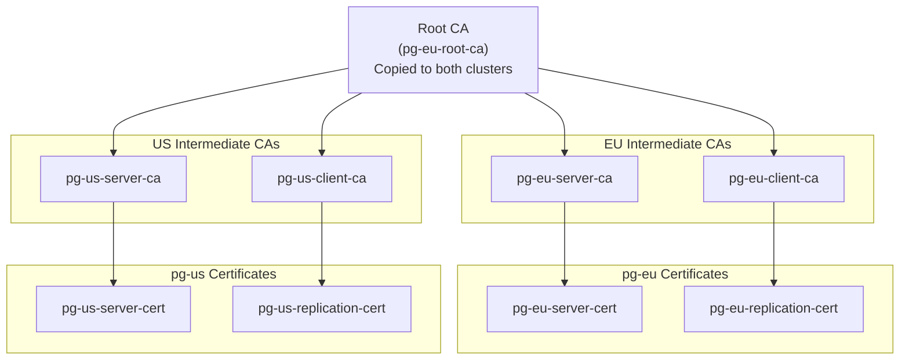

# Exercise 6: Cross-Cluster Replication with mTLS

- [Overview](#overview)
- [Prerequisites](#prerequisites)
- [Architecture](#architecture)
  - [Disaster Recovery Topology](#disaster-recovery-topology)
  - [Certificate Hierarchy](#certificate-hierarchy)
- [How It Works](#how-it-works)
  - [Replication Flow](#replication-flow)
  - [Certificate Usage](#certificate-usage)
- [Setting Up Cross-Cluster Replication](#setting-up-cross-cluster-replication)
  - [Step 1: Copy Root CA to US Cluster](#step-1-copy-root-ca-to-us-cluster)
  - [Step 2: Create US Intermediate CAs and Certificates](#step-2-create-us-intermediate-cas-and-certificates)
  - [Step 3: Apply Certificate Configuration to pg-us](#step-3-apply-certificate-configuration-to-pg-us)
  - [Step 4: Deploy the pg-us Replica Cluster in US Cluster](#step-4-deploy-the-pg-us-replica-cluster-in-us-cluster)
- [Testing Replication](#testing-replication)
  - [Test Cross-Cluster mTLS Connection](#4-test-cross-cluster-mtls-connection-us-client--eu-pgbouncer)
- [Understanding the Configuration](#understanding-the-configuration)
  - [pg-us Certificate Configuration](#pg-us-certificate-configuration)
- [Monitoring Replication](#monitoring-replication)
  - [Check Cluster Status](#check-cluster-status)
  - [Verify mTLS Configuration](#verify-mtls-configuration)
  - [Monitor Replication Lag](#monitor-replication-lag)
- [Troubleshooting](#troubleshooting)
- [Cleanup](#cleanup)
- [Next Steps](#next-steps)
- [Production Considerations](#production-considerations)
- [Automation Script](#automation-script)

## Overview

This exercise demonstrates CloudNativePG's distributed topology feature for
cross-cluster disaster recovery using mutual TLS (mTLS) authentication. You'll
configure the `pg-us` cluster to bootstrap from `pg-eu`'s backup using certificates
from the same root Certificate Authority (CA), creating a unified PKI across
geographic clusters.

This exercise also demonstrates **cross-cluster client connectivity**, where a
client in the US cluster can connect to PgBouncer in the EU cluster using mTLS
certificates issued by different intermediate CAs but trusted by the same root CA.

**Note**: This exercise demonstrates **disaster recovery bootstrapping** from
cross-cluster backups, not continuous WAL streaming replication. For production
continuous replication, additional streaming replication configuration would be
needed.

This pattern is essential for:
- **Disaster Recovery**: Bootstrap a recovery cluster from another region's backup
- **Multi-Region Deployments**: Create regional clusters from a central backup
- **Cross-Region Client Access**: Clients in any region can access databases in other regions with unified auth
- **Data Sovereignty**: Clone data to specific jurisdictions
- **Testing/Staging**: Create test clusters from production backups

## Prerequisites

- **Exercise 5 must be completed first**. This exercise builds on the certificate
  infrastructure created in Exercise 5.
- The `pg-eu` cluster must be running with cert-manager certificates
- The three-tier PKI (Root CA, Intermediate CAs) must exist
- The CNPG Playground must have MinIO configured for both US and EU regions

**Note**: If `pg-us` was deployed during initial cluster setup, Exercise 6 will
automatically remove it at the start to ensure a clean demonstration of
cross-cluster disaster recovery bootstrap.

Verify prerequisites:

```bash
# Check that pg-eu is running in EU cluster
kubectl --context=kind-k8s-eu get cluster pg-eu

# Check that certificates exist
kubectl --context=kind-k8s-eu get certificate pg-eu-root-ca

# Check that Exercise 5 was completed
kubectl --context=kind-k8s-eu get pooler pg-eu-pooler-rw

# Check if pg-us exists (will be removed by Exercise 6)
kubectl --context=kind-k8s-us get cluster pg-us
```

## Architecture

### Disaster Recovery Topology

```mermaid
flowchart LR
    subgraph eu [EU Kubernetes Cluster - kind-k8s-eu]
        pgeu[pg-eu Cluster<br/>Primary<br/>Read-Write<br/>3 instances]
        minioeu[MinIO-EU<br/>Backup Storage]
    end
    
    subgraph us [US Kubernetes Cluster - kind-k8s-us]
        pgus[pg-us Cluster<br/>Standby/DR<br/>Read-Only<br/>3 instances]
        minio us[MinIO-US<br/>Backup Storage]
    end
    
    pgeu -->|"Backup via<br/>barman-cloud"| minioeu
    pgus -.->|"Bootstrap from<br/>pg-eu backup"| minioeu
    pgus -->|"Own backups"| miniousend
```

**Key Points**:
- pg-eu and pg-us run in **separate Kubernetes clusters** (kind-k8s-eu and kind-k8s-us)
- pg-us bootstraps from pg-eu's backup in MinIO-EU (cross-cluster restore)
- Both clusters use the **same Root CA** for certificate trust
- This demonstrates **disaster recovery** setup, not continuous replication
- **Cross-cluster mTLS**: US clients can connect to EU PgBouncer using certificates from different intermediate CAs

### Certificate Hierarchy

Both clusters use certificates from the **same Root CA**, but each region has
its own **Intermediate CAs**:



**Key Point**: Only the **Root CA** is shared. Each region (EU and US) has its own
**Intermediate CAs** signed by the shared Root CA. This mirrors production PKI
where each region manages its own intermediate CAs but trusts a common root.

## How It Works

### Replication Flow

1. **Bootstrap**: pg-us starts by recovering from pg-eu's backup in MinIO
2. **WAL Streaming**: pg-us connects to pg-eu to stream Write-Ahead Log (WAL) changes
3. **Authentication**: pg-us presents its `streaming_replica` certificate to pg-eu
4. **Verification**: pg-eu verifies the certificate using the shared Client CA
5. **Replication**: Changes made to pg-eu are streamed to pg-us in real-time

### Certificate Usage

| Connection | Certificate Used | Verified By | Purpose |
|------------|-----------------|-------------|---------|
| pg-us → pg-eu | pg-us-replication-cert (CN=streaming_replica) | pg-eu (via client-ca) | Authenticate replication connection |
| Clients → pg-us | Client certificates | pg-us (via client-ca) | Read-only queries on replica |

## Setting Up Cross-Cluster Replication

### Step 1: Copy Root CA to US Cluster

Only the **Root CA** needs to be copied from EU to US. The US cluster will create
its own Intermediate CAs signed by this root:

```bash
# Copy Root CA from EU to US cluster
kubectl --context=kind-k8s-eu get secret pg-eu-root-ca -o yaml | \
    kubectl --context=kind-k8s-us apply -f -
```

**Why only the Root CA?**
- Copying only the root reflects production PKI architecture
- Each region maintains its own intermediate CAs
- Limits blast radius if an intermediate CA is compromised
- Allows independent certificate lifecycle management per region

### Step 2: Create US Intermediate CAs and Certificates

Apply the certificate configuration in the US cluster. This will:
1. Create a root CA issuer using the copied root CA
2. Create US-specific intermediate CAs signed by the root
3. Create pg-us server and replication certificates

```bash
kubectl config use-context kind-k8s-us
kubectl apply -f lab/exercise-6-cross-cluster-replication/pg-us-certs.yaml
```

This creates:
- `pg-us-root-ca-issuer`: Issuer using the copied root CA
- `pg-us-server-ca`: US Server Intermediate CA
- `pg-us-client-ca`: US Client Intermediate CA  
- `pg-us-server-cert`: For TLS on pg-us services
- `pg-us-replication-cert`: For authenticating replication to pg-eu
- `pg-us-app-cert`: For application client connections

Wait for all certificates to be ready:

```bash
# Wait for intermediate CAs
kubectl wait --timeout=2m --for=condition=Ready \
    certificate/pg-us-server-ca certificate/pg-us-client-ca

# Wait for end-entity certificates
kubectl wait --timeout=2m --for=condition=Ready \
    certificate/pg-us-server-cert certificate/pg-us-replication-cert certificate/pg-us-app-cert
```

### Step 3: Apply Certificate Configuration to pg-us

Patch the pg-us cluster definition to use the certificates:

```bash
cd ~/cnpg-playground
patch -p1 < lab/exercise-6-cross-cluster-replication/pg-us.yaml.patch
```

Review the changes:

```bash
git diff demo/yaml/us/pg-us.yaml
```

### Step 4: Deploy the pg-us Replica Cluster in US Cluster

Deploy the replica cluster in the US Kubernetes cluster:

```bash
kubectl config use-context kind-k8s-us
kubectl apply -f demo/yaml/us/pg-us.yaml
```

Wait for pg-us to be ready (this will take several minutes as it bootstraps
from pg-eu's backup):

```bash
kubectl wait --timeout=10m --for=condition=Ready cluster/pg-us
```

Monitor the bootstrap process:

```bash
# Watch cluster status
kubectl get cluster pg-us -w

# Watch pod status
kubectl get pods -l cnpg.io/cluster=pg-us -w

# Check logs
kubectl logs -f pg-us-1 -c postgres
```

## Testing Replication

**0. Clean up existing pg-us (if present):**

If pg-us was deployed during initial setup, remove it first:

```bash
# Switch to US cluster
kubectl config use-context kind-k8s-us

# Check if pg-us exists
kubectl get cluster pg-us

# If it exists, delete it
kubectl delete cluster pg-us

# Clean up any leftover resources
kubectl delete pvc -l cnpg.io/cluster=pg-us

# Clean MinIO backup data
docker exec minio-us rm -rf /data/backups/pg-us
```

**1. Write data to pg-eu:**

```bash
kubectl exec -it deploy/pg-eu-pooler-rw -- psql -U postgres -c "
CREATE TABLE IF NOT EXISTS replication_test (
    id SERIAL PRIMARY KEY,
    test_data TEXT,
    created_at TIMESTAMP DEFAULT NOW()
);
INSERT INTO replication_test (test_data) 
VALUES ('Cross-cluster replication test at ' || now());
SELECT * FROM replication_test;
"
```

**2. Wait for replication (usually a few seconds):**

```bash
sleep 5
```

**3. Verify data on pg-us:**

```bash
kubectl exec -it pg-us-1 -- psql -U postgres -c "
SELECT * FROM replication_test ORDER BY id DESC LIMIT 5;
"
```

**4. Check replication status:**

```bash
# On pg-us (replica), check replication lag
kubectl exec -it pg-us-1 -- psql -U postgres -c "
SELECT 
    now() - pg_last_xact_replay_timestamp() AS replication_lag,
    pg_is_in_recovery() AS is_replica;
"

# On pg-eu (primary), check connected replicas
kubectl exec -it pg-eu-1 -- psql -U postgres -c "
SELECT 
    application_name,
    client_addr,
    state,
    sync_state,
    replay_lag
FROM pg_stat_replication;
"
```

**5. Verify mTLS is being used:**

```bash
# Check SSL connections on pg-eu
kubectl exec -it pg-eu-1 -- psql -U postgres -c "
SELECT 
    application_name,
    client_addr,
    ssl,
    version AS tls_version,
    cipher
FROM pg_stat_ssl 
WHERE application_name LIKE 'pg-us%';
"
```

### 4. Test Cross-Cluster mTLS Connection (US Client → EU PgBouncer)

This test demonstrates the power of the unified PKI - a client in the US cluster
can authenticate to PgBouncer in the EU cluster using certificates issued by
different intermediate CAs.

**Step 4a: Get PgBouncer Details from EU Cluster**

```bash
# Switch to EU cluster
kubectl config use-context kind-k8s-eu

# Get PgBouncer pod IP
PGBOUNCER_POD=$(kubectl get pods -l cnpg.io/poolerName=pg-eu-pooler-rw -o jsonpath='{.items[0].metadata.name}')
PGBOUNCER_POD_IP=$(kubectl get pod $PGBOUNCER_POD -o jsonpath='{.status.podIP}')
PGBOUNCER_PORT=5432

echo "PgBouncer Pod: $PGBOUNCER_POD"
echo "PgBouncer IP: $PGBOUNCER_POD_IP"
```

**Step 4b: Create Cross-Cluster Service Endpoint in US Cluster**

Create a service in the US cluster that points to the EU PgBouncer pod:

```bash
# Switch to US cluster
kubectl config use-context kind-k8s-us

# Create service and endpoint pointing to EU PgBouncer
cat <<EOF | kubectl apply -f -
---
apiVersion: v1
kind: Service
metadata:
  name: pg-eu-pooler-rw-external
spec:
  ports:
  - port: $PGBOUNCER_PORT
    targetPort: $PGBOUNCER_PORT
    protocol: TCP
  clusterIP: None
---
apiVersion: v1
kind: Endpoints
metadata:
  name: pg-eu-pooler-rw-external
subsets:
- addresses:
  - ip: $PGBOUNCER_POD_IP
  ports:
  - port: $PGBOUNCER_PORT
    protocol: TCP
EOF
```

**Step 4c: Deploy Test Client in US Cluster**

Deploy a client pod with US certificates:

```bash
kubectl --context=kind-k8s-us apply -f - <<EOF
apiVersion: v1
kind: Pod
metadata:
  name: us-cross-cluster-client
spec:
  restartPolicy: Never
  securityContext:
    fsGroup: 26
    runAsUser: 26
    runAsGroup: 26
  containers:
  - name: postgres-client
    image: ghcr.io/cloudnative-pg/postgresql:18
    command: ["/bin/bash", "-c", "sleep 3600"]
    volumeMounts:
    - name: client-cert
      mountPath: /etc/secrets/client
      readOnly: true
    - name: server-ca
      mountPath: /etc/secrets/ca
      readOnly: true
    env:
    - name: PGSSLCERT
      value: /etc/secrets/client/tls.crt
    - name: PGSSLKEY
      value: /etc/secrets/client/tls.key
    - name: PGSSLROOTCERT
      value: /etc/secrets/ca/ca.crt
    - name: PGSSLMODE
      value: verify-full
  volumes:
  - name: client-cert
    secret:
      secretName: pg-us-app-cert
      defaultMode: 0440
  - name: server-ca
    secret:
      secretName: pg-eu-root-ca
      defaultMode: 0440
EOF

# Wait for pod to be ready
kubectl --context=kind-k8s-us wait --timeout=60s --for=condition=Ready pod/us-cross-cluster-client
```

**Step 4d: Test Connection from US to EU**

```bash
# Connect from US client to EU PgBouncer
kubectl --context=kind-k8s-us exec us-cross-cluster-client -- psql \
  -h pg-eu-pooler-rw-external \
  -p $PGBOUNCER_PORT \
  -U app \
  -d app \
  -c "SELECT 'Cross-cluster mTLS SUCCESS!' AS result, current_database() AS database, inet_server_addr() AS server;"
```

**Expected Output:**

```
          result           | database |  server  
---------------------------+----------+----------
 Cross-cluster mTLS SUCCESS! | app      | 10.x.x.x
(1 row)
```

**Step 4e: Verify Certificate Details**

Check which certificate the US client is using:

```bash
kubectl --context=kind-k8s-us exec us-cross-cluster-client -- \
  openssl x509 -in /etc/secrets/client/tls.crt -noout -subject -issuer
```

You should see:
- **Subject**: `CN=app` (the US application client cert)
- **Issuer**: `CN=pg-us-client-intermediate-ca` (US intermediate CA)

**Step 4f: Cleanup Test Resources**

```bash
kubectl --context=kind-k8s-us delete pod us-cross-cluster-client
kubectl --context=kind-k8s-us delete service pg-eu-pooler-rw-external
kubectl --context=kind-k8s-us delete endpoints pg-eu-pooler-rw-external
```

**What This Demonstrates:**

1. **Unified PKI Across Clusters**: The US application client certificate (`pg-us-app-cert`) 
   is signed by `pg-us-client-ca`, but EU PgBouncer trusts it because the certificate chain validates:
   ```
   pg-us-app-cert (CN=app) → pg-us-client-ca → pg-eu-root-ca (trusted by EU)
   ```

2. **Cross-Region Authentication**: Clients in any region can access databases in other
   regions without duplicating certificate infrastructure

3. **Production Pattern**: This mirrors real multi-region deployments where applications
   in one region need to access databases in another region for failover or data access

## Understanding the Configuration

### pg-us Certificate Configuration

The patch adds this to `demo/yaml/us/pg-us.yaml`:

```yaml
certificates:
  serverTLSSecret: pg-us-server-cert
  serverCASecret: pg-us-server-ca      # US intermediate CA
  clientCASecret: pg-us-client-ca      # US intermediate CA
  replicationTLSSecret: pg-us-replication-cert
```

**How cross-cluster verification works:**
- pg-us presents `pg-us-replication-cert` to pg-eu
- pg-eu verifies the certificate chain: `pg-us-replication-cert` → `pg-us-client-ca` → `pg-eu-root-ca`
- Because pg-eu trusts the root CA, it accepts the US certificate even though it was
  issued by a different intermediate CA

**Cross-cluster client access:**
- A client in US cluster can connect to EU PgBouncer using US client certificates
- EU PgBouncer validates the certificate chain back to the shared root CA
- This demonstrates the power of unified PKI across distributed systems

### Replication Configuration

The `pg-us.yaml` already has replication configured:

```yaml
replica:
  self: pg-us
  primary: pg-eu
  source: pg-eu

externalClusters:
- name: pg-eu
  plugin:
    name: barman-cloud.cloudnative-pg.io
    parameters:
      barmanObjectName: minio-eu
      serverName: pg-eu
```

The `replicationTLSSecret` provides the certificate for pg-us to authenticate when
connecting to pg-eu for WAL streaming.

## Monitoring Replication

### Check Replication Health

```bash
# Summary status
kubectl cnpg status pg-us

# Detailed cluster info
kubectl get cluster pg-us -o yaml
```

### Monitor Replication Lag

```bash
# Create a monitoring loop
watch -n 2 "kubectl exec -it pg-us-1 -- psql -U postgres -t -c \"
SELECT 
    CASE 
        WHEN pg_last_xact_replay_timestamp() IS NULL THEN 'N/A'
        ELSE (now() - pg_last_xact_replay_timestamp())::text
    END AS replication_lag;
\""
```

### View Replication Metrics

```bash
# Prometheus metrics (if enabled)
kubectl port-forward svc/pg-us-r 9187:9187 &
curl localhost:9187/metrics | grep cnpg_pg_replication
```

## Troubleshooting

### Issue: pg-us fails to start

**Check cluster events:**
```bash
kubectl get events --sort-by='.lastTimestamp' | grep pg-us
kubectl describe cluster pg-us
```

**Common causes:**
- MinIO credentials not configured
- Network connectivity between regions
- Certificate not ready

### Issue: Replication lag is high

**Check WAL accumulation:**
```bash
kubectl exec -it pg-eu-1 -- psql -U postgres -c "
SELECT 
    slot_name,
    slot_type,
    active,
    pg_size_pretty(pg_wal_lsn_diff(pg_current_wal_lsn(), restart_lsn)) AS retained_wal
FROM pg_replication_slots;
"
```

**Check network latency:**
```bash
kubectl exec -it pg-us-1 -- ping pg-eu-rw.default.svc.cluster.local
```

### Issue: Certificate verification fails

**Verify certificate chain:**
```bash
# Check that pg-us can see the CAs
kubectl get secret pg-eu-server-ca -o jsonpath='{.data.ca\.crt}' | base64 -d | openssl x509 -text -noout

# Check certificate issuer
kubectl get certificate pg-us-replication-cert -o yaml
```

## Cleanup

To remove the pg-us cluster and certificates:

```bash
cd ~/cnpg-playground
bash lab/exercise-6-cross-cluster-replication/cleanup.sh
```

This will:
- Delete the pg-us cluster
- Remove pg-us certificates
- Revert configuration changes
- Keep pg-eu and Exercise 5 resources intact

## Next Steps

After completing this exercise, you can:

1. **Test failover**: Promote pg-us to primary and demote pg-eu to replica
2. **Add more replicas**: Create pg-ap (Asia-Pacific) cluster
3. **Monitor replication**: Set up Grafana dashboards for replication metrics
4. **Test network partitions**: Simulate region failures
5. **Implement switchover procedures**: Document promotion steps

## Production Considerations

When implementing cross-cluster replication in production:

- **Network Reliability**: Ensure stable connectivity between regions
- **Monitoring**: Alert on replication lag and certificate expiration
- **Backup Strategy**: Each region should have independent backups
- **Certificate Rotation**: Plan for coordinated certificate updates
- **Disaster Recovery**: Document and test failover procedures
- **Read Replica Scaling**: Consider read-only replicas in each region
- **Data Sovereignty**: Verify compliance with regional data regulations

## Automation Script

After you've learned how cross-cluster replication works through the manual steps above,
you can use the automation script to quickly set up and verify the configuration:

```bash
cd ~/cnpg-playground
bash lab/exercise-6-cross-cluster-replication/test-cross-cluster-replication.sh
```

The script automates all the manual steps you practiced:
1. Cleans up any existing pg-us cluster
2. Copies Root CA from EU to US cluster
3. Creates US intermediate CAs and certificates
4. Deploys pg-us cluster in US
5. Verifies bootstrap from pg-eu backup
6. Tests cross-cluster mTLS connection (US client → EU PgBouncer)
7. Displays certificate and cluster details

This script is primarily used to validate that the manual steps in this README are correct
and can also be used for quickly setting up the exercise environment for demonstrations.
